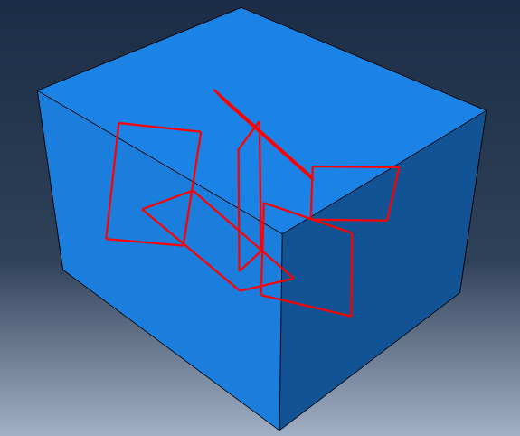

# Abaqus Random Rectangle Generator

A Python-based framework for generating randomly oriented, non-overlapping rectangular plates inside a three-dimensional box and automatically creating the corresponding Abaqus model.

This project combines computational geometry algorithms with Abaqus scripting to generate reproducible finite element geometries containing randomly distributed rectangular features.

The code is designed for applications such as:

- Stochastic geometry generation
- Representative Volume Element (RVE) modeling
- Composite material simulations
- Random inclusion/plate distribution studies
- Abaqus automation workflows


## Example Generated Model

An example of the generated Abaqus geometry is shown below:




# Features

- Automatic generation of randomly positioned rectangular plates in 3D
- Random orientation using ZXZ Euler angles
- Uniform sampling of 3D rotations
- Non-overlapping rectangle placement
- Minimum clearance control between rectangles
- Minimum clearance control from box boundaries
- Separating Axis Theorem (SAT)-based collision detection
- Automatic Abaqus geometry creation
- Reproducible results using user-defined random seeds
- Modular Python architecture


# Repository Structure

```
abaqus-random-rectangle-generator/

│
├── main.py
│   └── Main execution script
│
├── parameters.py
│   └── User-defined model parameters
│
├── generate_rectangles.py
│   └── Random rectangle generation algorithm
│
├── generate_model.py
│   └── Abaqus model construction
│
├── rectangles_intersection.py
│   └── SAT-based intersection and clearance checking
│
├── rectangles_vertices.py
│   └── 3D rectangle vertex calculation
│
├── rotation_matrix_zxz.py
│   └── ZXZ Euler rotation matrix calculation
│
├── README.md
│   └── Project documentation
│
├── LICENSE
│   └── MIT License
│
└── images/
    └── generated_model.png
        └── Example Abaqus model screenshot
```


# Requirements

- Abaqus/CAE with Python scripting support
- Abaqus Python environment
- NumPy available in the Abaqus Python environment

The script is intended to be executed using Abaqus/CAE.


# Running the Script

The script can be executed using either the Abaqus command line interface or the Abaqus/CAE graphical user interface.


## Method 1: Run Using Abaqus Command Line

Place all Python files in the same folder.

Open the Abaqus Command Prompt, navigate to the project folder, and run:

```bash
abaqus cae noGUI=main.py
```

Abaqus will execute the script without opening the graphical interface.


## Method 2: Run Using Abaqus/CAE GUI

The script can also be executed directly from Abaqus/CAE.

Steps:

1. Place all Python files in the same folder.

2. Open **Abaqus/CAE**.

3. From the menu bar select:

```
File → Run Script...
```

4. Browse to the project folder.

5. Select:

```
main.py
```

6. Click **OK**.

Abaqus will execute the script and generate the model automatically.


# Generated Model

After successful execution, Abaqus creates a model named:

```
GeneratedModel
```

The generated model contains:

- A three-dimensional rectangular box.
- Randomly oriented rectangular plates.
- A merged geometry containing all generated rectangles.

The generated model can then be:

- inspected,
- modified,
- meshed,
- assigned materials,
- assigned loads and boundary conditions,
- analyzed using the standard Abaqus workflow.


# Configuration

All user-defined parameters are located in:

```
parameters.py
```

Example:

```python
config = {
    "BOX_DIMS": (60.0, 40.0, 50.0),
    "RECT_DIMS": (25.0, 15.0),
    "NUM_RECTANGLES": 6,
    "MAX_ATTEMPTS": 100000,
    "RANDOM_SEED": 42,
    "MIN_CLEARANCE": 1.0,
}
```


## Parameters Description

| Parameter | Description |
|---|---|
| `BOX_DIMS` | Dimensions of the containing 3D box (X,Y,Z) |
| `RECT_DIMS` | Dimensions of each rectangle |
| `NUM_RECTANGLES` | Number of rectangles to generate |
| `MAX_ATTEMPTS` | Maximum random placement attempts |
| `RANDOM_SEED` | Seed for reproducible geometry generation |
| `MIN_CLEARANCE` | Minimum allowed distance between objects |


# Algorithm Description

The geometry generation process consists of four main steps.


## 1. Random Orientation Generation

Each rectangle is assigned a random three-dimensional orientation using ZXZ Euler angles:

- Alpha rotation around global Z-axis
- Beta rotation around global X-axis
- Gamma rotation around global Z-axis

The rotation matrix is calculated in:

```
rotation_matrix_zxz.py
```


## 2. Vertex Transformation

Each rectangle is initially defined in its local coordinate system.

The local coordinates are transformed into global coordinates using:

```
rectangles_vertices.py
```


## 3. Collision and Clearance Detection

The project uses the Separating Axis Theorem (SAT) to determine whether two rectangles violate the required spacing.

Implemented in:

```
rectangles_intersection.py
```

The algorithm considers:

- Rectangle face normals
- Edge cross products
- Coplanar configurations
- Numerical tolerance handling


## 4. Abaqus Model Generation

After valid rectangle configurations are generated, the Abaqus geometry is created automatically.

Implemented in:

```
generate_model.py
```


# Workflow

```
Modify parameters.py
        |
        ↓
Run main.py in Abaqus
        |
        ↓
Generate random rectangle positions and orientations
        |
        ↓
Check intersection and clearance conditions
        |
        ↓
Create Abaqus geometry
        |
        ↓
Continue with finite element modelling
```


# Reproducibility

The generated geometry can be reproduced by keeping the same:

- Random seed
- Box dimensions
- Rectangle dimensions
- Number of rectangles
- Clearance requirements


# Future Improvements

Possible future extensions:

- Automatic material assignment
- Automatic mesh generation
- Boundary condition generation
- Abaqus job submission automation
- Post-processing tools
- Additional inclusion geometries
- Visualization utilities


# Author

**Ayad Al-Rumaithi**


# Citation

If you use this software in academic work, please cite it as:

```
Al-Rumaithi, A. (2026).
Abaqus Random Rectangle Generator.
GitHub repository.
```


# License

This project is licensed under the MIT License.

See the `LICENSE` file for details.


# Acknowledgements

This project uses:

- Abaqus Python scripting environment
- NumPy numerical computing library
- Separating Axis Theorem for geometric collision detection